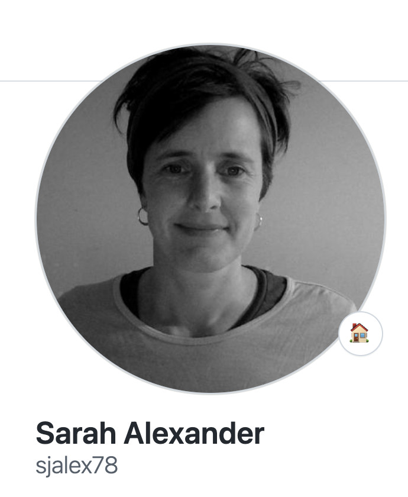
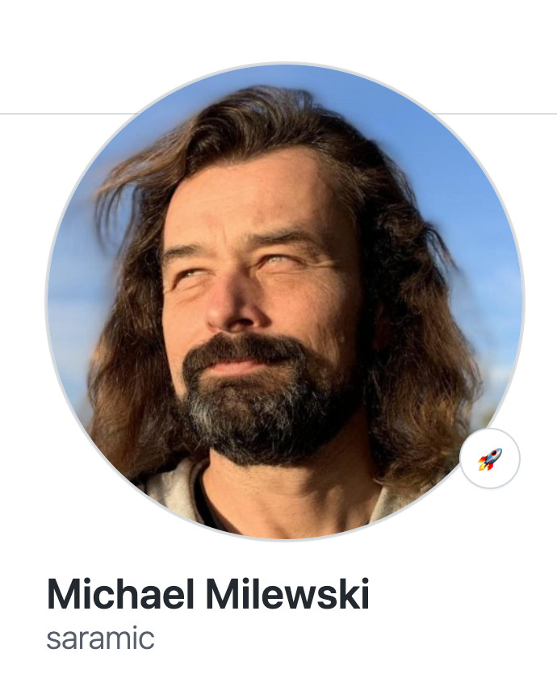

# Rails Shorts Demo

## Rails testing for first timers

**Adressing**

- https://github.com/rails-oceania/melbourne-ruby/issues/187

intro to testing in rails

- add rspec/capybara gems for testing
- first "End to End" (E2E) "user flow" through your app
- "arrange" (When) and "assert" (Then) statements
- make it run in the browser
- abstract the page with a Page Object Model using
  [site_prism](https://github.com/site-prism/site_prism) gem
- delete cruft with assurance of tests
- how to incrementally build your app

## Presenters




## to run

```
bundle exec
bundle exec rails db:prepare
bundle exec rails server
bundle exec rspec
bundle exec rubocop
```

